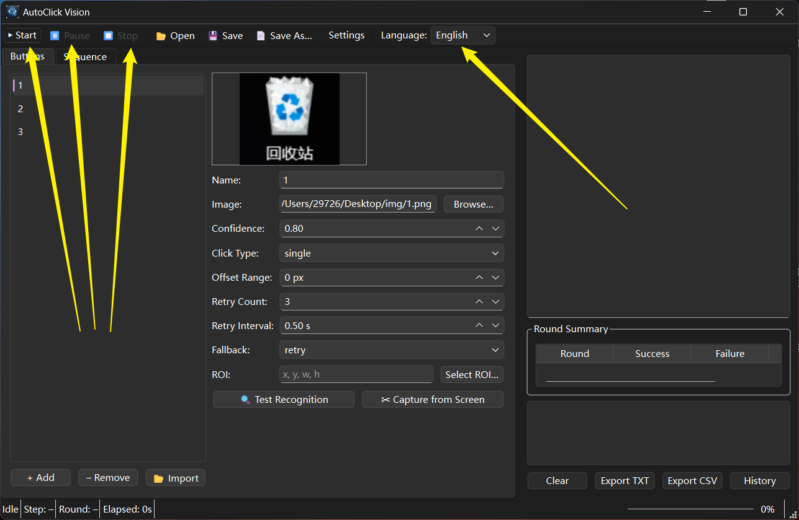
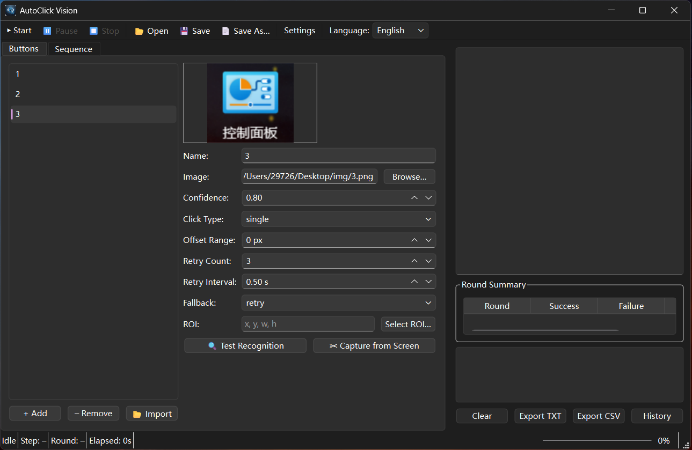
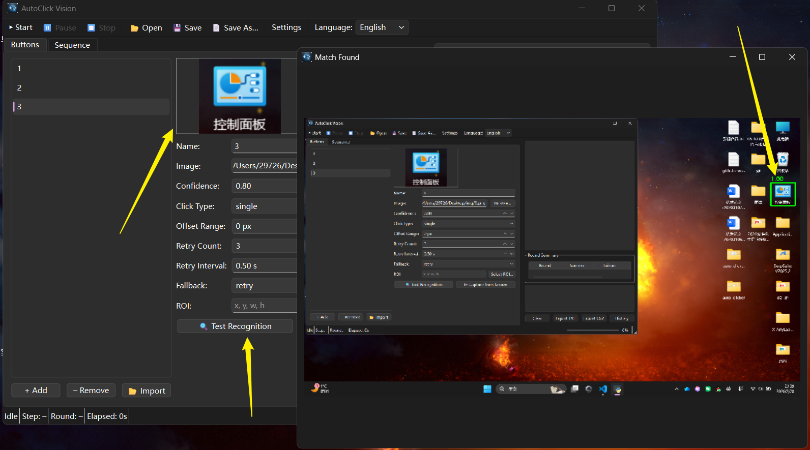
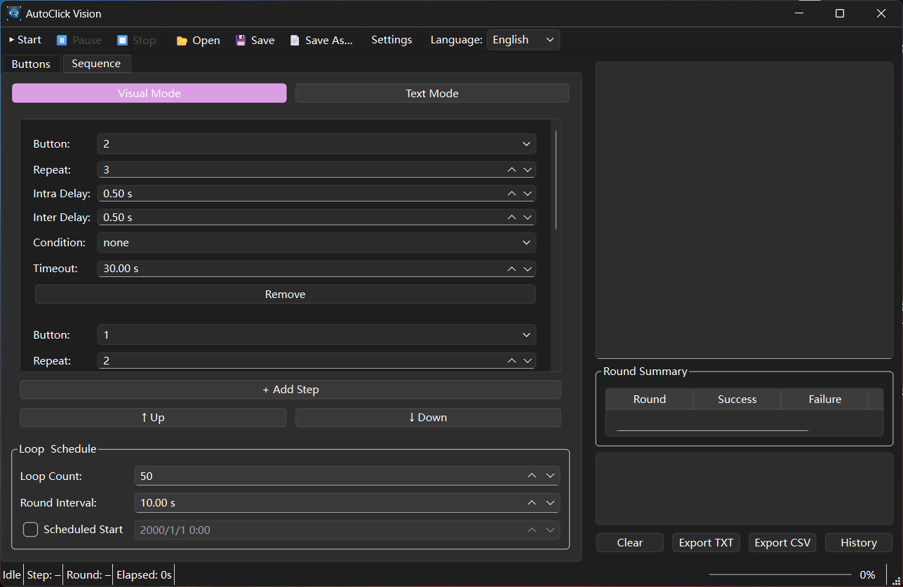
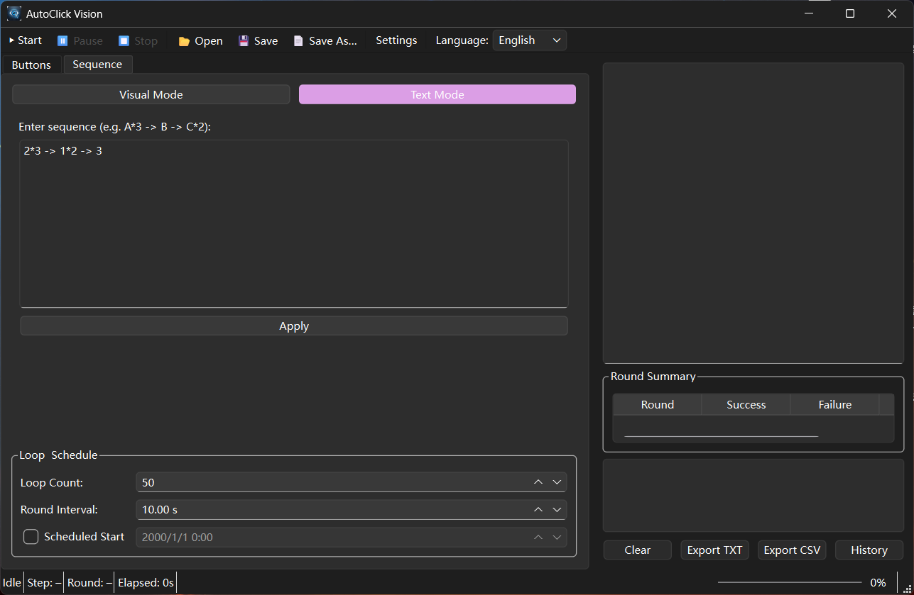

**English** | [中文](README_zh.md)

# AutoClick Vision

> Image-recognition-based auto-clicker that detects on-screen buttons via OpenCV template matching and clicks them automatically.
>
> **Stack:** Python 3 · OpenCV · mss · PyAutoGUI · PyQt6



---

## Features

| Category                      | Highlights                                                                                                                                                                                                                              |
| ----------------------------- | --------------------------------------------------------------------------------------------------------------------------------------------------------------------------------------------------------------------------------------- |
| **Screen Capture**      | High-performance full-screen & region capture via `mss`; multi-monitor support; thread-safe (per-thread `mss` instances)                                                                                                            |
| **Template Matching**   | Single-scale & multi-scale matching (`TM_CCOEFF_NORMED`); per-button confidence threshold; grayscale mode; region-restricted search (ROI)                                                                                             |
| **Smart Clicking**      | Single / double / right-click / long-press; random coordinate offset (±N px); Bézier-curve mouse movement;`pydirectinput` mode for fullscreen games                                                                                 |
| **Sequence Scheduling** | Text syntax (`A*3 -> B -> C*2`) and visual card-based editor; conditional steps (wait-appear / wait-disappear); mutual-exclusion recognition; configurable intra/inter-button delays                                                  |
| **Loop Control**        | Configurable round count & interval; scheduled start; chained multi-task execution; duration-based & consecutive-failure stop conditions                                                                                                |
| **Watchdog**            | Heartbeat monitoring; screen-inactivity detection; auto-restart on freeze                                                                                                                                                               |
| **Configuration**       | JSON / YAML configs; import / export; preset templates; auto-save; config versioning with migration                                                                                                                                     |
| **UI**                  | PyQt6 main window with sliding Visual ↔ Text mode; drag-and-drop button editor; scrollable color-coded step cards; real-time log viewer with screenshot thumbnails; system tray icon; global hotkeys (F9 / F10 / F11); settings dialog |
| **Error Handling**      | Global exception handler; failure-rate alerting; Webhook notifications (Telegram / DingTalk / Slack); screenshot archiving                                                                                                              |

---

## Project Structure

```
autoclickVision/
├── core/
│   ├── capture.py          # Screen capture (thread-safe mss)
│   ├── matcher.py          # Template matching engine
│   ├── clicker.py          # Mouse click automation
│   ├── scheduler.py        # Sequence scheduler & loop control
│   └── watchdog.py         # Freeze / inactivity watchdog
├── config/
│   ├── config_manager.py   # Config read / write / validation
│   └── presets/            # Saved preset templates
├── ui/
│   ├── main_window.py      # Main window & toolbar
│   ├── button_editor.py    # Button config panel & screen capture overlay
│   ├── sequence_editor.py  # Sliding visual / text sequence editor
│   ├── log_viewer.py       # Real-time log viewer & round summary
│   └── settings_dialog.py  # Application settings dialog
├── notifications.py        # Exception handling & webhook notifier
├── logs/                   # Runtime logs & screenshot archives
│   └── screenshots/        # Auto-saved failure screenshots
├── assets/                 # Icons & captured button images
│   └── captures/           # Screen-captured button crops
├── tests/                  # Unit tests
├── requirements.txt
├── main.py                 # Entry point
└── README.md
```

---

## Quick Start

### 1. Create a Virtual Environment (recommended)

```bash
python -m venv .venv
# Windows
.venv\Scripts\activate
# Linux / macOS
source .venv/bin/activate
```

### 2. Install Dependencies

```bash
pip install -r autoclickVision/requirements.txt
```

### 3. Run the Application

```bash
python -m autoclickVision.main
```

The main window will open with a system tray icon. You can minimize to tray and double-click the icon to restore.

---

## Global Hotkeys

| Key | Action         |
| --- | -------------- |
| F9  | Start          |
| F10 | Pause / Resume |
| F11 | Stop           |

---

## Usage Guide

### Adding Buttons

1. Open the **Buttons** tab in the left panel.
2. Click **+ Add** or drag-and-drop image files (PNG, JPG, BMP) onto the panel.
3. Use **✂ Capture from Screen** to draw a rectangle on your screen — the cropped region is saved and added as a new button.
4. Use **Select ROI…** to restrict where matching looks on the screen.
5. Configure each button: name, confidence threshold, click type, retry strategy.
6. Click **🔍 Test Recognition** to verify matching on the live screen.





### Creating a Sequence

1. Switch to the **Sequence** tab.
2. **Visual Mode** — click **+ Add Step** to create color-coded step cards; reorder with **↑ Up** / **↓ Down**; scroll when there are many steps.



3. **Text Mode** — type a sequence like `Login*1 -> Confirm*3 -> Close` and press **Apply** (a success / error prompt is shown).



4. Switching between modes uses a sliding animation.
5. Configure per-step: button, repeat count, intra/inter delay, condition (none / wait-appear / wait-disappear), timeout.
6. Set **Loop Count**, **Round Interval**, and optional **Scheduled Start** in the Loop & Schedule panel.

### Settings

Open **Settings** from the toolbar to configure:

- Grayscale matching mode
- Multi-scale matching (scale range & step)
- Bézier-curve mouse movement
- DirectInput mode
- Screenshot archiving
- Failure-rate threshold & window
- Webhook URLs
- Stop conditions (consecutive failures / duration limit)

### Saving / Loading Configs

- **📂 Open** / **💾 Save** / **📄 Save As…** on the toolbar manage task configurations.
- Configs are stored as JSON or YAML and can be shared across machines.

---

## Building a Standalone Executable

Using the included build script:

```bash
python build.py
```

Or manually:

```bash
pip install pyinstaller
pyinstaller --onefile --windowed autoclickVision/main.py --name AutoClickVision
```

The resulting `dist/AutoClickVision.exe` can be distributed without requiring a Python installation.

---

## Running Tests

```bash
python -m pytest autoclickVision/tests/ -v
```

---

## Dependencies

| Package                    | Purpose                              |
| -------------------------- | ------------------------------------ |
| `opencv-python` >= 4.8   | Image matching & processing          |
| `mss` >= 9.0             | Fast screen capture                  |
| `pyautogui` >= 0.9.54    | Mouse / keyboard automation          |
| `pydirectinput` >= 1.0.4 | Low-level input for fullscreen games |
| `PyQt6` >= 6.6           | GUI framework                        |
| `numpy` >= 1.24          | Array operations                     |
| `pyyaml` >= 6.0          | YAML config support                  |
| `keyboard` >= 0.13       | Global hotkeys                       |
| `Pillow` >= 10.0         | Image utilities                      |
| `requests` >= 2.31       | Webhook HTTP calls                   |

---

## License

MIT
